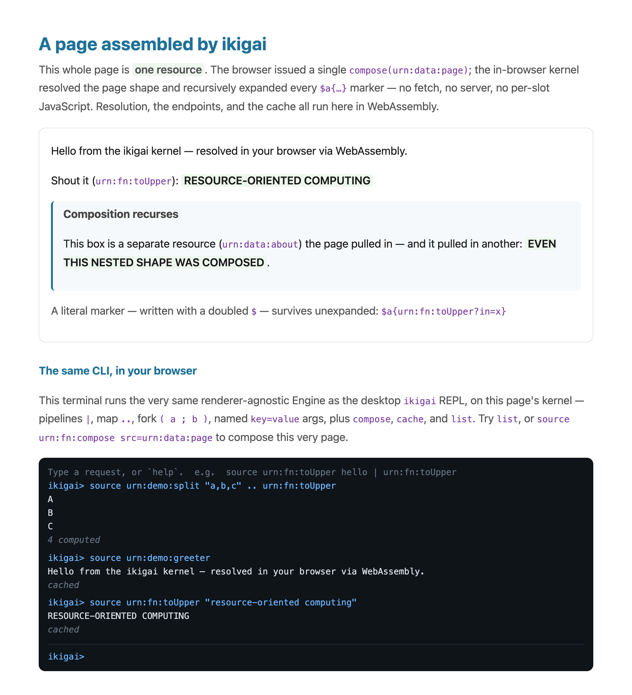

# ikigai-web-demo

The [ikigai](https://crates.io/crates/ikigai-core) resolution kernel running
**in the browser** via WebAssembly — no server, no fetch, no JS framework.

The page **is** a resource. `index.html` is a near-empty shell that makes one call —
`compose('urn:data:page')` — and drops the result into the body. The kernel resolves
the page *shape* (HTML) and recursively expands every `$a{<iri>}` transclusion marker
in it, resolving each embedded resource through the kernel; a marker may carry
arguments (`$a{urn:fn:toUpper?in="resource-oriented computing"}`) and a transcluded
shape may contain further markers, so composition recurses. Resolution, the endpoints,
the `compose` builtin, and the content-addressed cache all run client-side in WASM. The
client is ~5 lines of glue — the layout *and* its contents come from the kernel.



The page even carries a live **terminal** — the *same* renderer-agnostic Engine the
desktop `ikigai` REPL uses, compiled to WASM and driving this page's kernel. It's
mounted by composition too: a `$a{urn:demo:web-cli}` marker in the page shape resolves
to an `<ikigai-cli>` element that wires itself up on insertion. Because it shares the
page's kernel and content-addressed cache, typing `source urn:fn:compose
src=urn:data:page` into it returns the very page you're reading — reported `cached`,
since the page already composed it. The whole grammar works in the browser: pipelines
`|`, map `..`, fork `( a ; b )`, named `key=value` args, plus `compose`, `cache`, and `list`.

It depends on the published [`ikigai-core`](https://crates.io/crates/ikigai-core)
and [`ikigai-vocab`](https://crates.io/crates/ikigai-vocab) crates, so a fresh
checkout builds on its own.

## Prerequisites

- A Rust toolchain (`rustup`).
- The WASM target: `rustup target add wasm32-unknown-unknown`
- `wasm-bindgen-cli`, matching the `wasm-bindgen` version in `Cargo.toml` (`=0.2.108`):
  `cargo install wasm-bindgen-cli --version 0.2.108`
- Something to serve static files over HTTP (the examples use Python 3's built-in
  server). Serving over HTTP matters: the browser needs the `application/wasm`
  MIME type, which opening the file as `file://` does not provide.

## Run it

From the repository root:

```bash
# 1. Compile the crate to a raw .wasm (no JS bindings yet).
cargo build --release --target wasm32-unknown-unknown

# 2. Generate the JS glue + processed .wasm into dist/, next to index.html.
wasm-bindgen --target web --out-dir dist \
  target/wasm32-unknown-unknown/release/ikigai_web_demo.wasm

# 3. Serve dist/ over HTTP and open the page.
cd dist && python3 -m http.server 8087 --bind 127.0.0.1
```

Then open <http://127.0.0.1:8087>.

The page fills its slots from the kernel on load, and the **Interactive** section
lets you SOURCE `urn:fn:toUpper` / `urn:fn:reverseList` against your own input.

### After editing `src/lib.rs`

Re-run steps 1–2, then refresh the browser — the running server picks up the new
files. If nothing changed, you only need step 3 (the `dist/` artifacts are reused).

### Alternative: `trunk serve`

[`trunk`](https://trunkrs.dev) can do build + bindgen + serve + live-reload in one
command. It expects to drive its own `index.html` at the crate root, whereas this
demo ships a hand-written `dist/index.html` with an explicit ES-module import — so
the three-step recipe above matches what's in the repo.

## What's in here

- `src/lib.rs` — binds the kernel's endpoints (including the `compose` builtin) and
  the page/about *shape* resources, and exposes `compose` / `issue` / `describe` to JS
  via `wasm-bindgen` (the `async fn`s become JS `Promise`s; the browser event loop is
  the executor — no threads, no tokio). `compose` forks a shape's `$a{}` markers and
  joins them, so it resolves concurrently on a multi-threaded kernel and sequentially
  in the browser for now.
- `dist/index.html` — a near-empty shell: one `compose('urn:data:page')` call that
  fills the body. The only committed file under `dist/`; the `.js`/`.wasm` are
  generated by step 2 and gitignored.

## License

Demo code; same license as the ikigai crates (MIT OR Apache-2.0).
