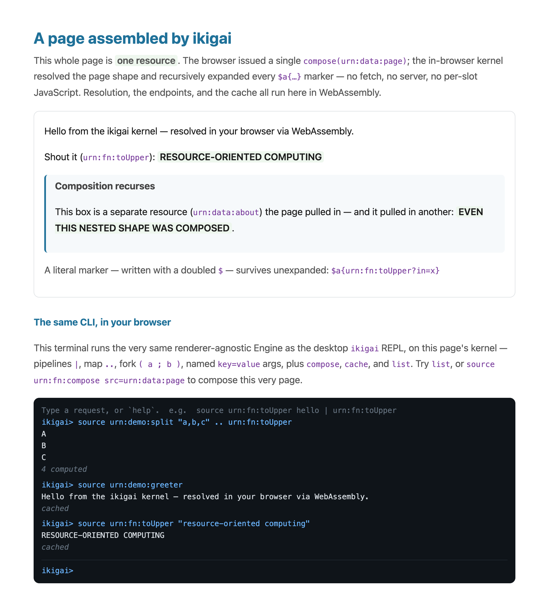

# ikigai-web-demo

The [ikigai](https://crates.io/crates/ikigai-core) resolution kernel running
**in the browser** via WebAssembly — no server, no fetch, no JS framework.

**▶ Live demo: <https://ikigai-rs.github.io/ikigai-web-demo/>**

The page **is** a resource. `index.html` is a near-empty shell that makes one call —
`compose('urn:data:page')` — and drops the result into the body. The kernel resolves
the page *shape* (HTML) and recursively expands every `$a{<iri>}` transclusion marker
in it, resolving each embedded resource through the kernel; a marker may carry
arguments (`$a{urn:iki:fn:toUpper?in="resource-oriented computing"}`) and a transcluded
shape may contain further markers, so composition recurses. Resolution, the endpoints,
the `compose` builtin, and the content-addressed cache all run client-side in WASM. The
client is ~5 lines of glue — the layout *and* its contents come from the kernel.



The page even carries a live **terminal** — the *same* renderer-agnostic Engine the
desktop `ikigai` REPL uses, compiled to WASM and driving this page's kernel. It's
mounted by composition too: a `$a{urn:demo:web-cli}` marker in the page shape resolves
to an `<ikigai-cli>` element that wires itself up on insertion. Because it shares the
page's kernel and content-addressed cache, typing `source urn:iki:fn:compose
src=urn:data:page` into it returns the very page you're reading — reported `cached`,
since the page already composed it. The whole grammar works in the browser: pipelines
`|`, map `..`, fork `( a ; b )`, named `key=value` args, plus `compose`, `cache`, `cap`, and `list`.

**A namespace migration you can watch happen.** `ikigai-fn` 0.2.0 moved the four names it
owns from `urn:fn:*` into the shared `urn:iki:` namespace, and this host installs a
rewrite table (`Kernel::with_aliases`) in the same release that adopts the bump. So
`source urn:fn:toUpper hello` still answers here, `source urn:iki:fn:toUpper hello` comes
back `cached` off the *same* entry — one cache entry and one golden thread for both names —
and `list` advertises only the new one, so anything that discovers resources by reading the
catalog migrates itself. `source urn:kernel:aliases` reads the table back out with a live
hop count. The about box on the page is the proof in situ: its inner marker still names
`urn:fn:toUpper`, two levels down inside a composed page, and renders anyway.

**And the window is now closing, which is the more interesting half.** `ikigai-fn` 0.2.0
published on 2026-09-04, this host adopted it within the hour, and `ikigai-cli` followed
three days later in 0.1.18 with a table of its own — each at its own cadence, no flag day,
which is exactly what the rule was for. With the other hosts across, the table stops
protecting *hosts* and starts protecting names written down where a host cannot reach them:
`ikigai-runbook` 0.1.13 is a published crate this page links, and it hardcodes `source
urn:fn:toUpper hello`. Which poses the question the exhibit is really about — *when do you
delete an alias?* Discovery has already migrated itself, and the hop count cannot answer,
because the about box fires the rule once per composition on purpose and so it never reaches
zero. A rule like this comes out on a schedule, not on a signal.

A row of **ZeroTrust** buttons above the terminal walks the capability story, enforced
client-side in WASM: `cap read-only` narrows the session to a *read* scope, after which a
`sink urn:file:…` write is refused (`capability does not grant `write``) while reads still
resolve — and the file module's **jail** refuses to escape its root (`../../…`) even at
full authority. The *same* `cap` command and enforcement as the native CLI.

**Two SHACL engines, one resource.** `urn:shacl:validate` is served in the page by the real
[`ikigai-shacl`](https://crates.io/crates/ikigai-shacl) crate (rudof) by default, compiled to
wasm and loaded as a lazy module on the first validation, exactly like the XSLT and JSON-LD
modules (about 1.9 MB over the wire, once). Open the page with **`?shacl=js`** and the same
name is served instead by the JavaScript
[shacl-engine](https://github.com/zazuko/shacl-engine), kept for comparison. The two report
the same verdicts and violations; rudof also gives each violation a `message` and `value`.
The engine is chosen when the kernel is built, so a page never mixes two engines' reports
under one cache entry; the Demo tab's SHACL steps run unchanged on either, and the smoke
gate holds the two to the same verdicts.

It depends on the published [`ikigai-core`](https://crates.io/crates/ikigai-core),
[`ikigai-vocab`](https://crates.io/crates/ikigai-vocab), and
[`ikigai-engine`](https://crates.io/crates/ikigai-engine) crates, so a fresh
checkout builds on its own.

## Prerequisites

- A Rust toolchain (`rustup`).
- The WASM target: `rustup target add wasm32-unknown-unknown`
- `wasm-bindgen-cli`, matching the `wasm-bindgen` version in `Cargo.toml` (`=0.2.108`):
  `cargo install wasm-bindgen-cli --version 0.2.108`
- Something to serve static files over HTTP (the examples use Python 3's built-in
  server). Serving over HTTP matters: the browser needs the `application/wasm`
  MIME type, which opening the file as `file://` does not provide.

## Run it

From the repository root:

```bash
# 1. Compile the crate to a raw .wasm (no JS bindings yet).
cargo build --release --target wasm32-unknown-unknown

# 2. Generate the JS glue + processed .wasm into dist/, next to index.html.
wasm-bindgen --target web --out-dir dist \
  target/wasm32-unknown-unknown/release/ikigai_web_demo.wasm

# 3. Serve dist/ over HTTP and open the page.
cd dist && python3 -m http.server 8087 --bind 127.0.0.1
```

Then open <http://127.0.0.1:8087>.

The page fills its slots from the kernel on load, and the **Interactive** section
lets you SOURCE `urn:iki:fn:toUpper` / `urn:iki:fn:reverseList` against your own input.

### After editing `src/lib.rs`

Re-run steps 1–2, then refresh the browser — the running server picks up the new
files. If nothing changed, you only need step 3 (the `dist/` artifacts are reused).

### Alternative: `trunk serve`

[`trunk`](https://trunkrs.dev) can do build + bindgen + serve + live-reload in one
command. It expects to drive its own `index.html` at the crate root, whereas this
demo ships a hand-written `dist/index.html` with an explicit ES-module import — so
the three-step recipe above matches what's in the repo.

## Network demo: pull the page over WebTransport

The page above hosts the kernel *in the browser*. The companion demo
(`dist/net.html`) does **not** — it pulls the **same** `urn:data:page` from a kernel
running in a separate **server process**, over
[WebTransport](https://developer.mozilla.org/en-US/docs/Web/API/WebTransport)
(HTTP/3 over QUIC). The browser sends the `compose` request as `ikigai-wire` bytes —
the *same* protocol `ikigai-ipc`/`ikigai-quic` speak — the server composes the page
remotely, and streams the assembled HTML back. Only the wire codec runs in WASM; the
kernel is on the other end.

The composed page's terminal is **live too**: each command (`source <iri>`, `compose
<iri>`, `cache <iri>`, `list`) is its own `ikigai-wire` Call on a fresh WebTransport
stream, resolved by the remote kernel — so `source urn:iki:fn:toUpper hi` twice shows
`computed` then `cached`, the *server's* cache.

```bash
# build the WASM glue first (steps 1–2 above), then:
cargo run --bin ikigai-net-server     # serves on https://127.0.0.1:4433 (loopback only),
                                      # prints a cert hash and its file jail (default
                                      # ~/.ikigai/web-demo/ws; `-- 4433 --root /abs/dir`)
cd dist && python3 -m http.server 8087
# open http://127.0.0.1:8087/net.html — paste the printed cert hash (or use #cert=<hash>)
```

The cert is self-signed and **rotates each run**; the browser trusts it via
WebTransport's `serverCertificateHashes` (no CA), so paste the current hash.
`urn:file:*` on the server is jailed to an absolute directory, resolved once at startup
and printed: `--root DIR`, or `<data home>/web-demo/ws` (`~/.ikigai/web-demo/ws`) by
default, created if missing. It no longer depends on where the server was launched.

The server authenticates no client and resolves every call as **root**, so it binds
**loopback only** (`127.0.0.1`) by default. `--bind ADDR` widens it, and the server says
so at start: anyone who reaches that address with a QUIC client can read and write the
jail. A browser session must also come from an allowed `Origin`, by default the pages'
own (`http://127.0.0.1:8087`, `http://localhost:8087`, `https://ikigai-rs.github.io`);
`--allow-origin ORIGIN` (repeatable, `*` for any) replaces that list. A session from any
other origin is refused with 403 at the handshake. That stops a page on another site, not
a non-browser client, which can send any `Origin` or none.
Needs Chrome/Edge (or recent Firefox). It isn't on GitHub Pages — Pages is
static-only, and this needs a running server — so it's run-it-yourself.

## Conformance

The host passes [`ikigai-conformance`](https://crates.io/crates/ikigai-conformance) —
the module recipe as one test (`tests/conformance.rs`), run natively over the same kernel
the page composes: every endpoint this crate binds has typed inputs, declared faces and
scopes, and its cacheability pinned (constants cached forever, live session state never,
the clock until the next minute). The crates it composes are walked too; their findings at
the pinned versions are recorded, not waived, and drop as each publishes its conformant
release. `tests/k_adapter.rs` runs the runbook's own steps through the `/k/` adapter under
the session capability — the write a `read-only` session or another identity's segment
refuses is a typed `Denied`, before anything touches the disk.

## What's in here

- `src/lib.rs` — the in-browser kernel: binds the demo endpoints (incl. `compose`)
  and the page shapes, and exposes `evalLine` (the CLI Engine over the kernel) plus
  the network demo's wire codec (`encodeComposeCall` / `decodeReply`) to JS via
  `wasm-bindgen`.
- `src/bin/server.rs` — the WebTransport kernel server (native; `wtransport` +
  `ikigai-wire`), reusing the same `build_kernel()` so it composes the same page.
- `dist/index.html` — the in-browser demo (one `compose('urn:data:page')` → body).
- `dist/net.html` — the network demo (pull `urn:data:page` over WebTransport).
  The committed files under `dist/`; the `.js`/`.wasm` are generated and gitignored.

## License

Demo code; same license as the ikigai crates (MIT OR Apache-2.0).
